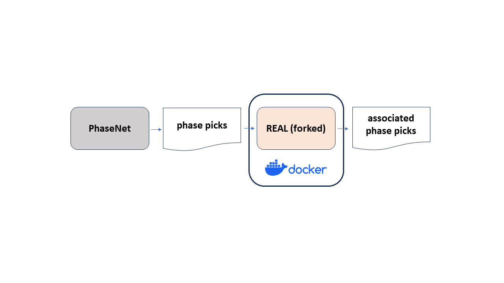

# REALAssociator
## Summary


 
* Tool to associate phase data from PhaseNet (Zhu and Beroza, 2019) using REAL (Zhang et al., 2019).
* Easy to run on various OS by using **docker**.

## Requirements
* OS <br>
  Support Windows, macOS and Linux

* (Only required for Windows) Git Bash <br>
  https://gitforwindows.org/ <br>
  For Windows, run "Git Bash" as administrator and use it to execute commands for following steps.

* docker <br>
  For Windows and macOS, install "Docker Desktop" and run it to activate docker. <br>
  https://docs.docker.com/get-docker/ <br>

  For Linux, install "Docker Engine". <br>
  https://docs.docker.com/engine/install/ <br>
    ```
    # Installation of docker (e.g. Ubuntu22.04)
    $ sudo apt-get update
    $ sudo apt-get install docker
    $ sudo docker -v # confirm installation
    ```
## Usage
* Download repository
  ```
  $ cd <base directory> # move to any directory (base directory) to clone REALAssociator
  $ git clone https://github.com/rintr-suzuki/REALAssociator.git
  $ cd REALAssociator
  ```
* See [here](docs/README-usage.md) for the detailed information.

## Acknowledgements
* This program is forked from the original version to test. Original version is [here](https://github.com/Dal-mzhang/REAL). <br>
See LISENCE for the copyright notice.

## References
* Hasegawa, A., Umino, N., & Takagi, A. (1978), Double-planed structure of the deep seismic zone in the northeastern Japan arc. Tectonophysics, 47(1–2), 43–58. https://doi.org/10.1016/0040-1951(78)90150-6
* Zhang, M., W.L. Ellsworth, & Beroza, G. C. (2019), Rapid Earthquake Association and Location, Seismol. Res. Lett., 90.6, 2276-2284. https://doi.org/10.1785/0220190052